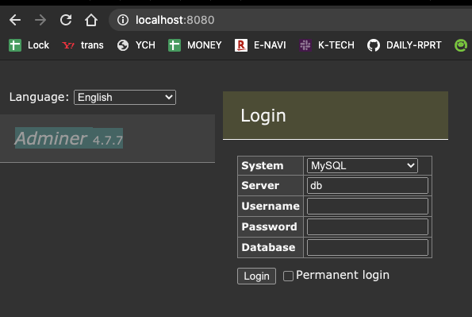
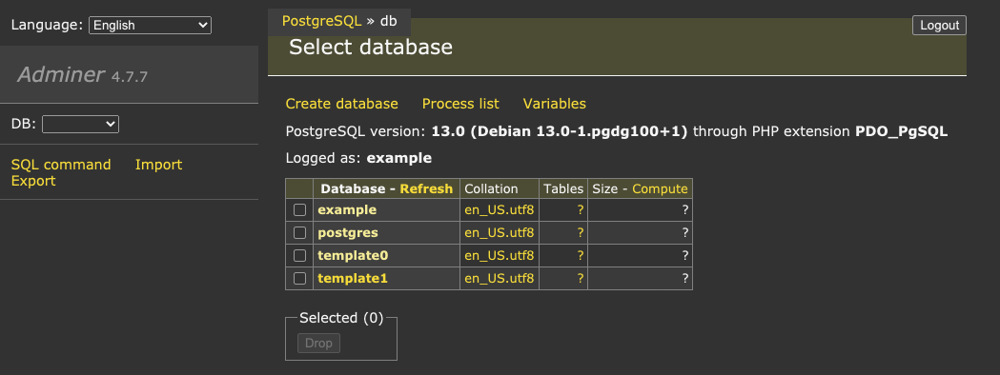

# Docker PostgresSQL

* この yml を stack deploy すると adminer が立ち上がる

* user と pass で login できる

## why

* Blitz.js docker compose を使うためには psql が必要だった

## what is this

* docker stack deploy (alt docker-compose) をする yml を置くところ

## 参考

[dockerhub-postgres](https://hub.docker.com/_/postgres)
